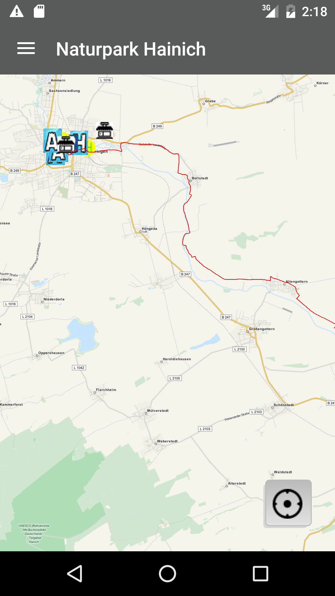
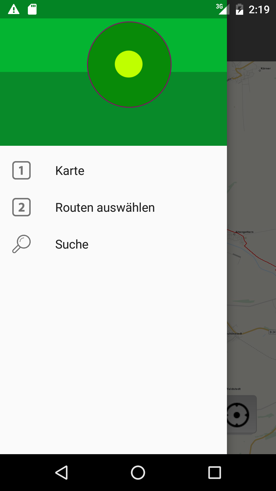
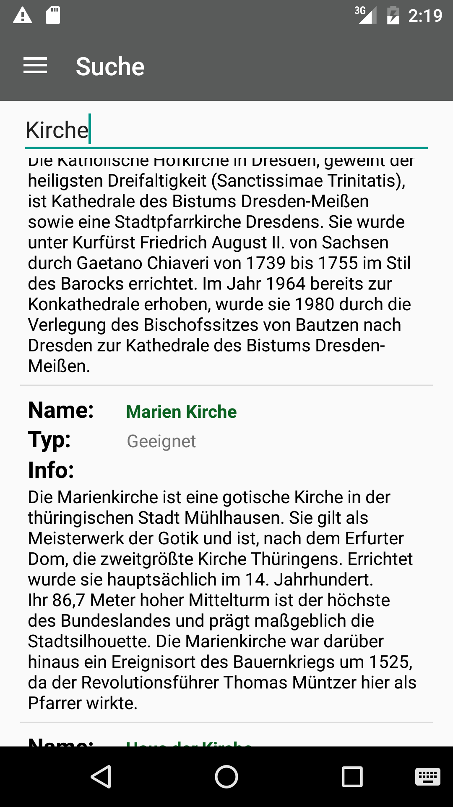
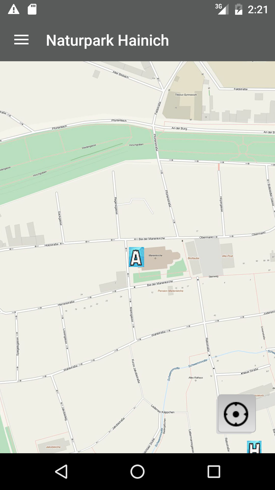
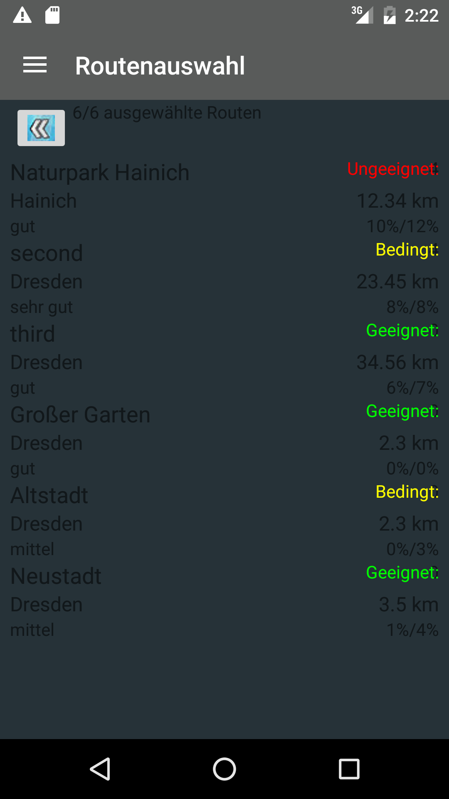
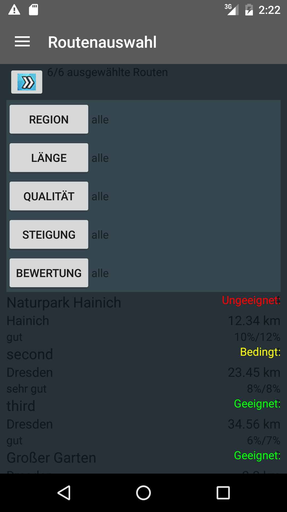

**Naturpark Hainich App**
***
Das Ziel der App ist eine Verbesserung der Orientierung durch Informationen auf einem mobilen Endgerät. Der Nutzer soll sich über die Behindertengerechtigkeit von Routen und POI informieren können. Des Weiteren gibt die App Informationen über Hindernisse, welche in acht Kategorien geteilt wurden und wobei für jede ein eigenes Icon verwendet wurde.
Folgende Hindernisse wurden unterteilt:
    + Schranke
    + Treppe
    + Engstelle
    + Stufe
    + Rinne
    + Poller
    + Abhang
Jedes Hindernis bekam sein eigenes Icon und kann bei einem Tap Event auf dieses auch seinen Namen in Form eines Toast wiedergeben.

Die POI wurden in folgende Gruppen unterteilt und eine Variable für  geeignet oder ungeeignet hinterlegt:
    + Hotel
    + Aussichtspunkt
    + Laden
    + Öffentlicher Nahverkehr
    + Parkplatz

In der App werden die Funktionen als Maptiles Offline gespeichert und können auch ohne Internet Verbindung genutzt werden. Die Grundlage der Karteninhalte und Map Events ist die Library OSMdroid.

Folgend sind anhand der Screenshots die Funktionen der App genauer dokumentiert.

Nutzer kann seinen Standort via Netzwerk oder GPS ermitteln. Es ist möglich seine genauen Koordinaten bei einem Click auf den Marker Icon zu erfahren, in Form eines Pop UP.
Hat er seinen Standort deaktiviert, bietet ihm ein Alert Dialog die Möglichkeit dies zu tun. 

